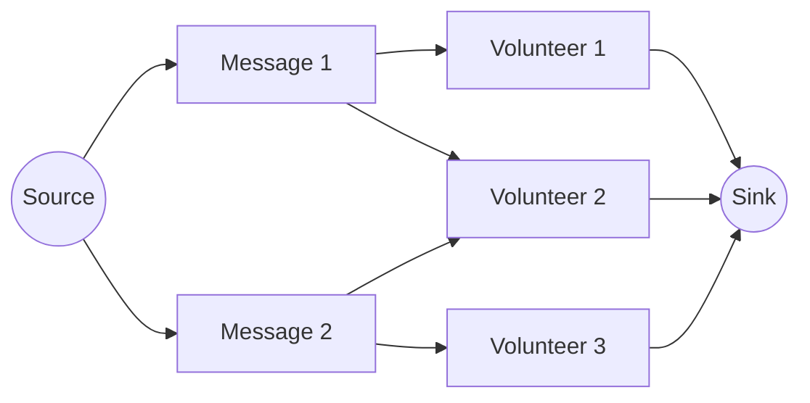
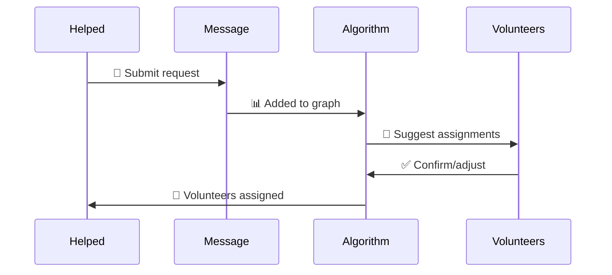

# 🚗 Project Yedidim

## 🌍 Overview
Project Yedidim is a backend system built with **ASP.NET Core**.  
It manages requests from people who need help (**Helpeds**) and coordinates responses from volunteers (**Volunteers**).  
Assignments are computed automatically using a **graph-based matching algorithm**. ⚡

## 👥 Roles
- 🧑‍🦽 **Helped**  
  A person who submits a request for assistance (creates a *Message*).  

- 🙋 **Volunteer**  
  A person who can be assigned to one or more requests.  

> 🔑 There is no "Admin" role.  
> ⚙️ Matching is determined by the algorithm, with the option for a volunteer to confirm or adjust suggestions.

## 🔀 Dispatch Algorithm
The dispatching system is modeled as a **flow network**:

✨ Key points:  
- Each **Message** can be assigned to ➕ multiple Volunteers.  
- Each **Volunteer** usually handles ➡️ one request at a time.  
- The algorithm finds the optimal set of assignments using **Max-Flow** 📈.  

## 📜 Flow Example

## 🛠️ Tech Stack
- ⚡ **ASP.NET Core 7.0**  
- 🗄️ **Entity Framework Core**  
- 🧩 **SQL Server**  
- 🖼️ **Mermaid.js** for diagrams

## 🎯 Conclusion
Project Yedidim provides a structured way to match people in need with volunteers,  
leveraging a graph-based algorithm with flexibility for one-to-many assignments.  
❤️ Making help more efficient and impactful.
